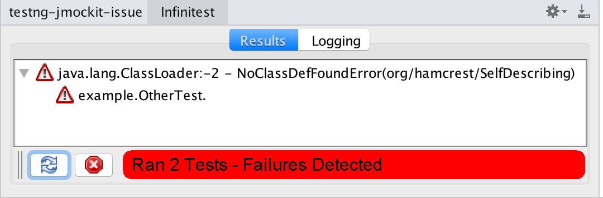
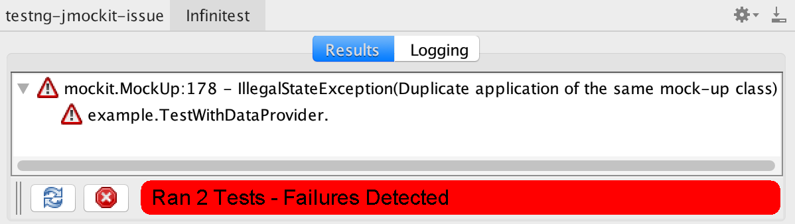
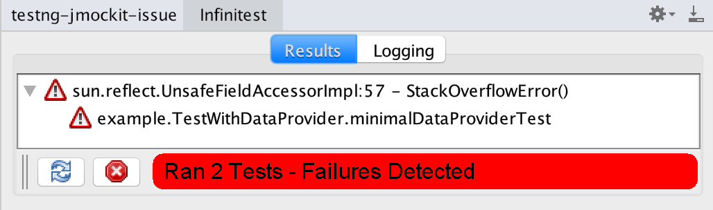

# Issues with infinitest + testng + jmockit + dataprovider

Running the tests with Intellij plugin *Infinitest*.
Using legacy version 5.1.116 or latest 5.2.0 show the same results:

- jmockit 1.26-1.29:

- jmockit 1.26-1.29 + hamcrest

- jmockit 1.30-1.35:

Now I will list some changes that individually applied let the above issues go away:

- jmockit 1.25 and before -> all tests pass

- jmockit 1.36 and after -> all tests pass

- disable `OtherTest` -> dataprovider test passes

- having `@Dataprovider` commented -> tests pass (also more than the one `OtherTest`)

- testng latest (6.14.3) -> all tests pass

- via `mvn test` -> all test pass
